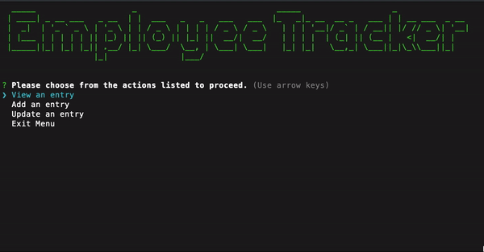
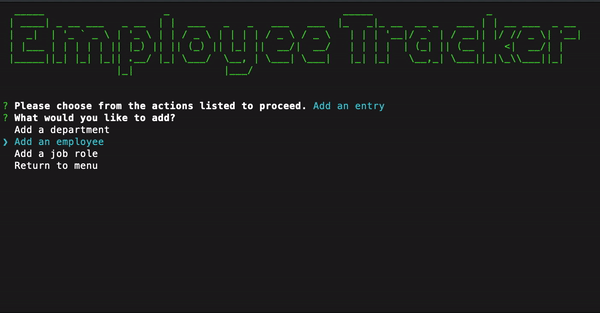
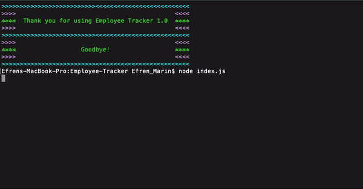

# Employee Tracker

## How to use
1) Download files onto local machine
2) Install all dependencies using NPM or Yarn
3) Set up database through MYSQL Workbench
4) Import schema and initial seed into MYSQL Workbench
5) Run node index.js on a CLI
6) Follow prompts 

## Purpose
This program creates a database where the user can process CRUD actions. They will be able to create employees, departments,and roles as well as view existing ones in the database. The user will also be able to maintain the database by updating or deleting the departments, employees, or roles. Using a CLI, the user can easily make changes and receive instant feedback.

## View Demo

## Add Demo

## Update Demo

## Project Status
Project was successfully completed and finished with no additional bugs found. 

## Reflection
The project started out easy to scope out and as I kept working on it I saw the complexity of it all. Learned a lot about SQL and MYSQL while completing this project. Enjoyed being able to display ASCII art on the terminal too!
 

No licenses. Creative purposes only. @Efrenmarin45 on GitHub.